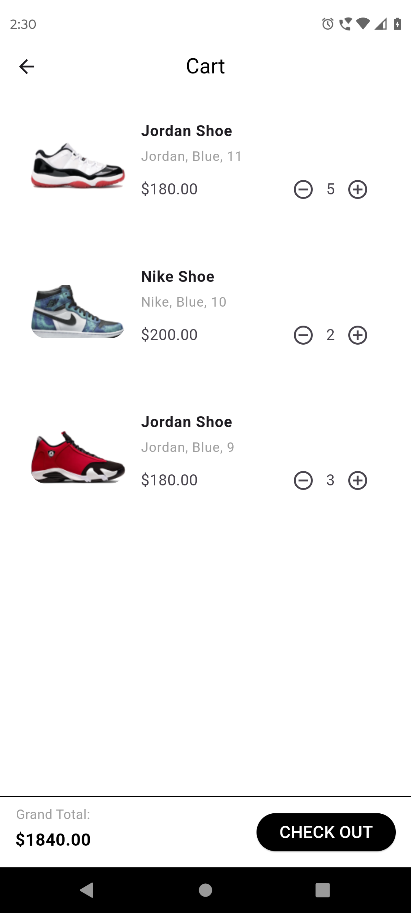

## shoesly (E-Commerce App)

### Project Overview
The app allows users to browse and purchase shoes from various brands, view product details, read and write reviews, manage a shopping cart, and proceed to checkout. 

### Tech Stack
- Flutter for cross-platform mobile development.
- Firebase for data storage, analytics, and computing average review scores.
- Shared Preferences for local data storage.

### Features
1. **Discover Page**:
   - Displays a grid list of shoes with infinite scroll.
   - Horizontal scroll view with filters for brands.
   - Shows image, name, price, number of reviews, and average rating for each product.
   - Includes a "Filter" button for further customization.

2. **Product Detail Page**:
   - Displays multiple images, color options, name, selectable size options, description, top 1 reviews, total review count, and price.
   - Includes an "Add to Cart" button.
   - Provides feedback when a product is added to the cart.
   - Shows popups if size and color are not selected before adding to the cart.

3. **Reviews Page**:
   - Allows users to view all reviews and filter by the number of stars.

4. **Cart Page**:
   - Shows all added items, allowing users to adjust the quantity or remove items from the cart.
   - Displays the grand total price and provides a checkout option.

5. **Checkout Page**:
   - Displays order summary, payment method, location, order details, and payment details.
   - Upon clicking on Payment, creates an order in the database (no real payment integration required).

6. **Filter and Sorting Options**:
   - Allows filtering by brands and price range.
   - Sorting options include most recent, lowest price, highest reviews, gender, and color.

### Additional Features
- Implemented error handling for failed API requests.
- Added feedback for user actions like adding items to the cart.
- Implemented checks to ensure the user selects size and color before adding to the cart.

### Project Setup
1. Clone the repository to your local machine.
2. Ensure you have Flutter and Firebase set up in your development environment.
3. Open the project in your preferred Flutter IDE.
4. Run `flutter pub get` to install dependencies.
5. Configure Firebase credentials in the project.
6. Run the app on your preferred emulator or physical device.

### Challenges Faced
- Implementing proper error handling for API requests.
- Ensuring responsiveness and UI consistency across different devices.
- Integrating Firebase for data storage and computing average review scores.
- Handling edge cases, such as ensuring users select size and color before adding to the cart.

### ScreenSots

- **Homepage**: 
  

- **Shoe Detail**: 
  

- **Add to Cart**: 
  

- **Added to Cart**: 
  

- **Cart**: 
  

- **Checkout**: 
  

- **Filter**: 
  

- **Reviews**: 
  

